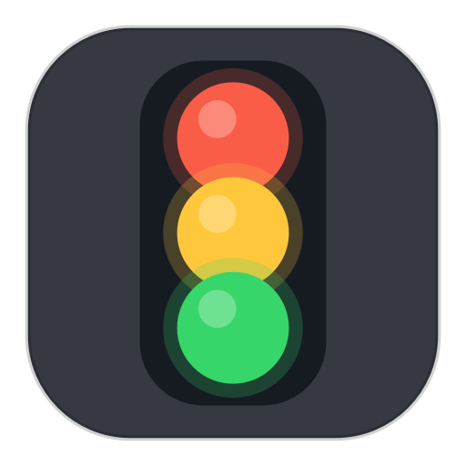

<p align="center">
  
</p>

<h1 align="center">🚦 Greenlight</h1>

<p align="center">
  <b>A tiny traffic light in your menu bar that shows what Claude Code is doing.</b><br>
  Working? Waiting on you? Done? Just glance up — stop babysitting the terminal.
</p>

<p align="center">
  
  
  
  
</p>

---

## ✨ Install — one line

```bash
curl -fsSL https://raw.githubusercontent.com/liorbar777/greenlight/master/install.sh | bash
```

A little traffic light pops into your menu bar. It **auto-starts at login** and adds **Greenlight.app** to your Applications. Done. 🎉

<sub>Prefer a clone? `git clone https://github.com/liorbar777/greenlight.git && cd greenlight && ./install.sh`</sub>

## 🎨 What the colors mean

| | State | What's up |
|---|---|---|
| ⚪ | gray | idle — nothing running |
| 🟡 | amber | Claude is working / thinking |
| ✨🟡 | **blinking amber** | **your turn** — a question or plan approval is waiting |
| 🟢 | green | finished, all good |
| 🔴 | red | finished on a bad note (a no-go verdict) |

Only the active lamp lights up — the others stay a calm gray. No tokens, no LLM calls, no network: it just reads a tiny state file the hooks write and redraws. 🪶

## 🟢🔴 Green or red when it finishes

Every finished turn is **green** by default. Want Claude to flag bad outcomes in **red** on its own? Add this to `~/.claude/CLAUDE.md`:

```markdown
## 🚦 Greenlight Verdict Marker
End your final message with `GREENLIGHT: NO-GO — <reason>` only when a turn ends
badly (failing tests, blocked task, unresolved error, a real risk). Otherwise emit nothing.
```

You can also drop a marker yourself anywhere in a reply (case-insensitive):

- 🟢 `GREENLIGHT: GO` — also `GREEN` `GOOD` `PASS` `OK` `SUCCESS` `DONE` `SHIP` `APPROVED` `LGTM`
- 🔴 `GREENLIGHT: NO-GO` — also `RED` `FAIL` `BAD` `BLOCK` `STOP` `ERROR` `REJECT` `ABORT`

## 🎛️ Controls

Click the light for a little menu:

- **Enabled** — grey it out / "unplug" it
- **Quit Greenlight**

Clicking the app icon while it's already running does nothing — no restart, no duplicate icons. 👍

## 🧰 What you need

- **macOS 10.13+**, Apple Silicon **or** Intel — the installer builds for your Mac.
- **A `python3`** (to build the tiny PyObjC venv). Don't have one? `xcode-select --install` or `brew install python`.
- **Claude Code** — that's what the light is watching. 🤖

## 🔧 How it works

Claude Code hooks → write a small `state.json` → the menu-bar app polls it and repaints. Everything lives in `~/Library/Application Support/Greenlight` and never leaves your machine.

> 💚 The green lamp shows a little logo. Drop a `wix_white.png` (white, transparent) next to the app to use your own.

## 👋 Uninstall

```bash
~/Library/Application\ Support/Greenlight/uninstall.sh
```

Removes the menu-bar app, the login agent, the hooks, and `Greenlight.app`.

<details>
<summary>🤓 Nerdy notes & troubleshooting</summary>

- **It launches as a plain process, not via the `.app`'s `exec`.** A bundle `exec python` launch leaves the macOS status item *invisible*; a plain process draws it. The LaunchAgent runs the script directly; the `.app` icon just kickstarts that agent.
- **Permission prompts ("Allow this command?") don't blink** — they stay solid amber. Claude Code doesn't fire a `Notification` hook for them, and there's no way to tell "waiting on a permission prompt" from "a tool is running." `AskUserQuestion` / `ExitPlanMode` *do* blink.
- **One light per machine** — it's shared across Claude Code sessions; concurrent sessions fight over the state. Fine for one active session.
- **Icon missing?** Run `~/Library/Application\ Support/Greenlight/greenlight.sh start`, or re-run the installer.
- **Light stopped updating?** Re-run the installer to repoint the hook (e.g. after upgrading Python).
- **Files:** `greenlight_app.py` (the menu-bar app), `greenlight_hook.py` (writes state + reads verdicts), `greenlight.sh` (start/stop/restart/status), `install.sh` / `uninstall.sh`, `make_icon.py` + `build_icns.sh` (regenerate the icon).
- A backup of your pre-Greenlight settings is saved to `~/.claude/settings.json.bak.greenlight`.

</details>

<p align="center"><sub>Made with 🚦 for Claude Code.</sub></p>
